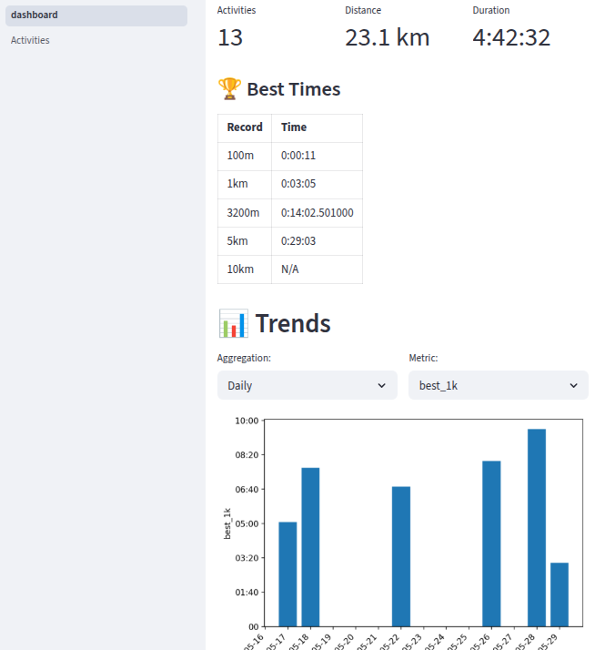
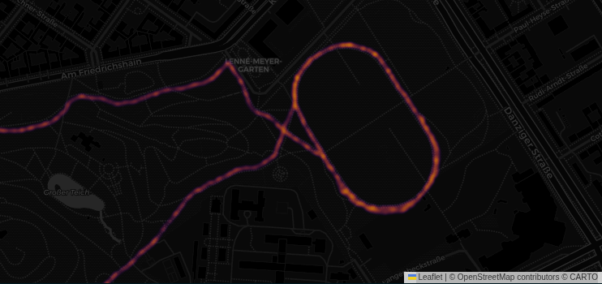

# Run

> What you can not measure, you cannot improve.

I don't think it's 100% true, it's just you would not know if it is improving or not.

I'm not 100% satisfied with Strava, I was more of an Endomondo enjoyer, but it died.

What here is better that Strava:

- Scripts are free, as in beer, and open source, as in freedom.
- Total privacy, your data is stored on your computer, so you even run on Aircraft carrier.
- Just important metrics - your records and training time.

Disadvantage - to compare yourself with friends you would need to
send them your data with PRs and stuff over email or by other means. But maybe it is
not that bad, as you should compare yourself with yourself and get some break
from social media.

## Usage

Your data is stored in tcx files in `data/` folder. Download your TCX files there.

### Dashboard 

Run `streamlit run dashboard.py` to generate a dashboard of your workouts, looking something similar to this:

### Heatmap

Run `python heatmap.py` to generate heatmap of your workouts, looking something similar to this:

### Connecting to Polar AccessLink API

Go to https://www.polar.com/accesslink-api/ to obtain your client id and secret, then store that values in following environment variables:

- `POLAR_CLIENT_ID`
- `POLAR_CLIENT_SECRET`

You could also store them in `my.env` file.

Then running `python fetch_polar.py` would download TCX files
for recent 30 days of workouts that you have not yet downloaded.
